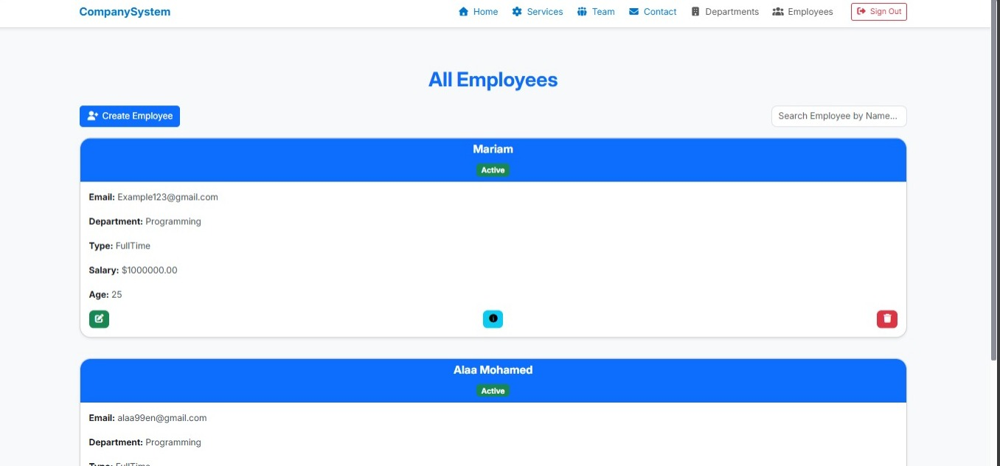
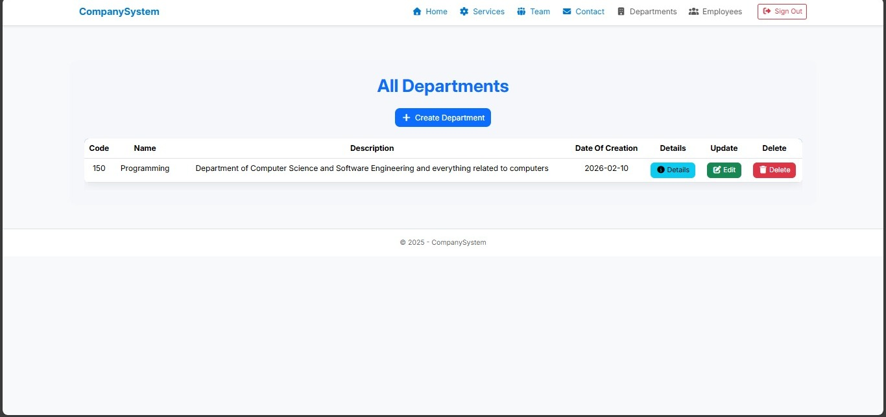

# CompanySystem

**CompanySystem** is a centralized platform for managing company departments, employees, and services with an intuitive and user-friendly interface.

---

## 🖥️ Screenshots

### Home Page

### Departments Page

### Employees Page

---

## ⚙️ Key Features

- **Department Management**: Create, update, and delete departments  
- **Employee Management**: Add, edit, delete, and view employee details  
- **User Authentication**: Secure login and logout functionality  
- **Service Overview**: Display company services, team, and contact information  

---

## 📂 Project Structure

- **Controllers/** – Contains all project controllers  
- **Views/** – Contains all user interface pages  
- **Models/** – Contains data models  
- **wwwroot/** – CSS, JS, and image assets  

---

## 🚀 Running the Project

1. Open the project in **Visual Studio**  
2. Ensure the database connection is configured  
3. Run the project using **F5** or **IIS Express**  
4. Explore the interface and features  

---

## 📌 Notes

- Built with **ASP.NET MVC** and **Tailwind CSS**  
- Database schema can be customized according to company needs
